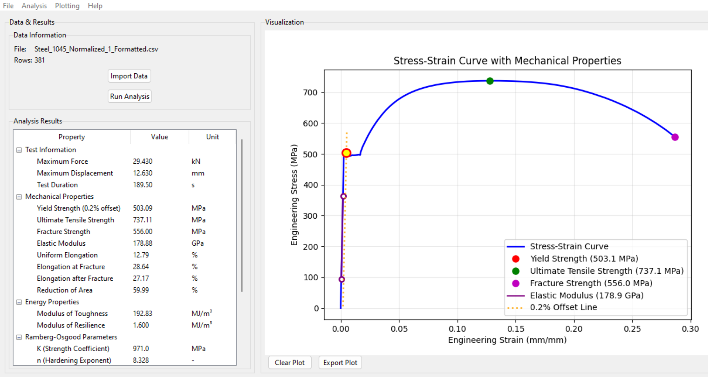
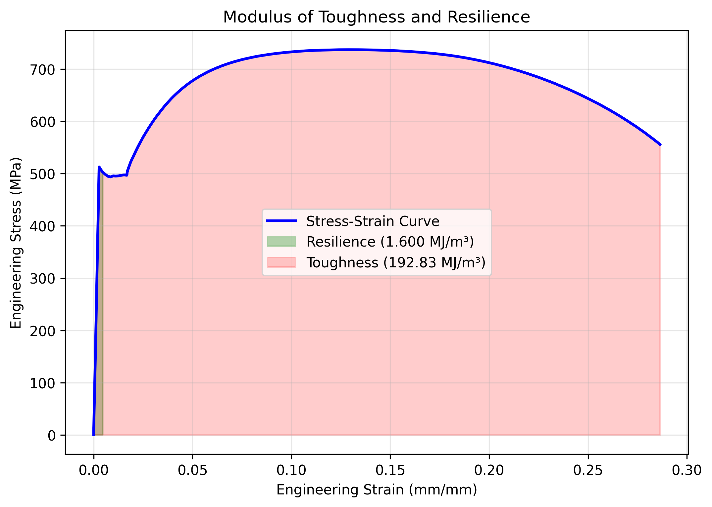
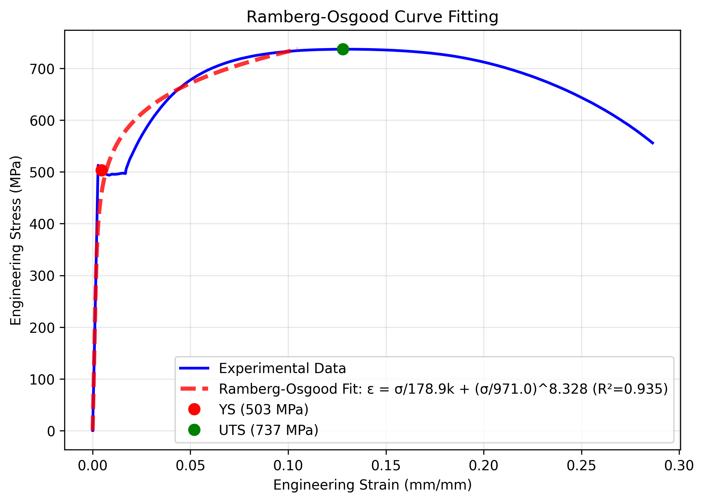

# Tensile Analyzer
[](https://doi.org/10.5281/zenodo.16783280)

[]()

This program processes and analyzes tensile test data in accordance with ASTM standards. Such data are often analyzed using spreadsheets and lack a standard methodology, which is prone to user error and tedious. This program aims to reduce such user errors and improve the accuracy and precision of the calculated mechanical properties more efficiently. 

The user can import their data file from a universal testing machine (UTM) containing force, displacement, and strain data. The program then analyzes this data to determine key mechanical properties such as ultimate tensile strength (UTS), yield strength (YS), elongation, reduction of area (RA), elastic modulus (EM), and monotonic properties in accordance with ASTM E8/E8M[^1] and ASTM E111[^2] requirements.

The following plots can be generated and exported:
- Stress-strain plot with annotated YS, UTS, and EM.
- Stress-strain plot with highlighted modulus of resilience and modulus of toughness areas.
- Engineering stress-strain plot overlayed with true stress-strain plot.
- Ramberg-Osgood[^3] curve fitting and parameters.
- Hollomon[^4] curve fitting and parameters.

## Table of Contents
- [Description](#tensile-analyzer)
- [Features](#features)
- [Installation Instructions](#installation-instructions)
- [Data Format](#data-format)
- [Examples and Testing](#examples-and-testing)
- [License and Citation](#citation-and-license)
- [References](#references)
## Features
The Tensile Analyzer has the following features:
- Import data in various formats.
- Analyze data in accordance with ASTM requirements.
- Calculate mechanical properties:
  - Ultimate Tensile Strength (UTS) in MPa as the maximum stress achieved.
  - Yield Strength (YS) in MPa as the intersection of a 0.2% offset line and the stress-strain curve.
  - Elastic Modulus (EM) or Young's Modulus in GPa as the gradient of a fitted slope to the middle 50% of datapoints in the linear elastic region.
  - Elongation at fracture in % as the maximum extension as a percentage of the original gauge length.
  - Elongation after fracture in % as the final gauge length as a percentage of the original gauge length.
  - Reduction of Area (RA) in % as the percentage decrease in the final cross-sectional gauge area compared with the original cross-sectional gauge area.
  - Modulus of Resilience (U<sub>r</sub>) in MJ/m<sup>3</sup> as the area under the linear elastic region.
  - Modulus of Toughness (U<sub>t</sub>) in MJ/m<sup>3</sup> as the area under the full stress-strain curve.
  - Ramberg-Osgood parameters
    - Strength coefficient, K in MPa.
    - Strain hardening exponent, n.
    - Quality of git, R<sup>2</sup>.
- Plot data:
  - Stress-strain curve with annotated mechanical properties.
  - Regions of resilience and toughness moduli.
  - Engineering vs true stress-strain curve.
  - Ramberg-Osgood curve fitting.
  - Hollomon curve fitting.
- Export plots and results in various data formats.
## Installation Instructions
To run the Tensile Analyzer program, the following prerequisite Python libraries must be installed:
```
pip install tkinter, pandas, numpy, matplotlib, scipy, os, warnings
```
After installing these prerequisites, the tensile_analyzer_XXX.py (where XXX is the relevant version of the program) file can be run in your IDE of choice, and the GUI will appear.

## Data Format
Data files exported from the UTM testing software can be imported into the Tensile Analyzer program in the following formats:
- CSV (.csv)
- XLSX (.xlsx)
- XLS (.xls)
- TXT (.txt)

The data file must be formatted to contain data for columns in the format and associated metric units defined below. The columns for recording the final post-fracture cross-sectional geometry of the tested specimen are optional. Multiple datapoints can be included for these columns, and the program will take the average of these post-fracture measurements to improve precision. If these columns are blank, the program won't calculate elongation after fracture or reduction of area accordingly.

> [!IMPORTANT]
>  The program currently only supports specimens with a circular cross-section.

### Circular cross-section specimens
| Time (s) | Extension (mm)	| Load (kN)	| Strain (mm/mm)	| Original Length (mm)	| Original Diameter (mm)	| Final Length (mm)	| Final Diameter (mm) |
<?  ### Rectangular cross-section specimens 
 | Time (s) | Extension (mm)	| Load (kN)	| Strain (mm/mm)	| Original Length (mm)	| Original Thickness (mm)	| Original Width (mm)	| Final Length (mm)	| Final Thickness (mm) | Final Width (mm) | ?>

## Examples and Testing

Tensile test data for 1045 Steel in the Normalized heat treatment conditions were used to test this program. The data used was obtained from the Materials Science and Engineering lab reports at the University of Illinois Urbana-Champaign[^5]. 3 test data files are in the "Test Data" folder and can be used to evaluate and experiment with the software. Below are some examples of the analyses and plots this software can perform.

 

 

<p align="center">

</p>

## Citation and License
If you adapt or use this software, please refer to the CITATION.cff file for the citation style. This software can be cited as follows:

Gibbons, D. W. (2025). Tensile Analyzer (Version 1.6) [Computer software]. https://doi.org/10.5281/zenodo.16783280

MIT License

Copyright (c) 2025 Duncan W. Gibbons, Ph.D.

## References

[^1]: ASTM International. Standard Test Methods for Tension Testing of Metallic Materials. ASTM E8/E8M, 2024.
[^2]: ASTM International. Standard Test Method for Young’s Modulus, Tangent Modulus, and Chord Modulus. ASTM E111, 2017.
[^3]: Ramberg, W., & Osgood, W. R., Description of stress–strain curves by three parameters. Technical Note No. 902, 1943, National Advisory Committee For Aeronautics, Washington, DC. 
[^4]: Hollomon, J. H., “Tensile Deformation,” Transactions of the Metallurgical Society of AIME, Vol. 162, 1945, pp. 268-290.
[^5]: https://files.mtil.illinois.edu/data/Courses/Spring%202025/MSE%20308/Tension%20Testing/Group%202/
